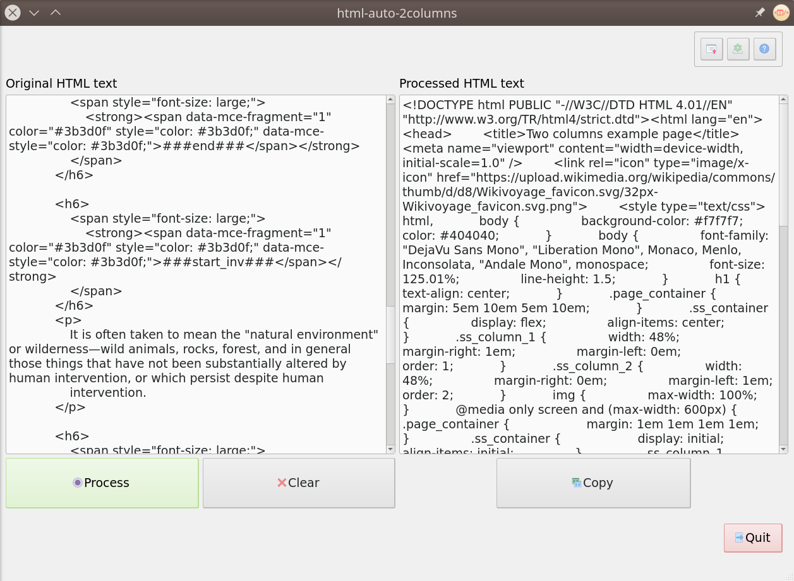

# html-auto-2columns
Automatically formats two columns in HTML text (this method adapts to the device screen dimensions).


Modify HTML page code to add 2 columns sections. This is done by
replacing ```<h6>``` elements that contain the following texts:

## Who can use this application?

This application is destined for people who wish to implement 2 columns in their blog, but also have access to the source HTML code. For example, **Shopify** has this functionality.

## Introduction

Firstly, we describe device aware 2 columns HTML. 

The following image shows a web page displaying 2 columns in desktop  view, and switches to one column  in mobile view:


In this image, the first example shows a classical columns order in the desktop view that follows the same one in the mobile view. Whereas, in the second example, it shows the inverse order of the columns order in the desktop view. Both views can be achieved by the following CSS code:

```css
.ss_container {
  display: flex;
  align-items: center;
}

.ss_column_1 {
  width: 48%;
  margin-right: 1em;
  margin-left: 0em;
  order: 1;
}

.ss_column_2 {
  width: 48%;
  margin-right: 0em;
  margin-left: 1em;
  order: 2;
}
@media only screen and (max-width: 600px) {
  .ss_container {
    display: initial;
    align-items: initial;
  }
  .ss_column_1, .ss_column_2 {
    float:none;
    width:100%;
    margin-right:0;
    margin-left: 0;
  }
  
}
```


## How to Install

The latest release can be downloaded from the link below (no installation needed):

[https://github.com/salaheddinek/html-auto-2columns/releases/latest](https://github.com/salaheddinek/html-auto-2columns/releases/latest)

Otherwise, The user can build the application using files in ```bundle``` folder:

## How to use




Once the application is downloaded, it can run without installation.


Following these steps will get the desired results:

1. Copy the CSS code to your website, this need to be done only once.
2. Insert ```<h6>``` titles with the according tags in order to wrap the sections that need to be 
formatted:
	
   * For direct 2 columns section insert ```<h6> ... ###start### ... </h6>```followed by the content of the **first** columns, followed by ```<h6> ... ###next### ... </h6>```, followed by the content of the **second** column, followed by ```<h6> ... ###end### ... </h6>```.

   * For opposite sides 2 columns ```<h6> ... ###start_inv### ... </h6>```followed by the content of the **second** columns, followed by ```<h6> ... ###next### ... </h6>```, followed by the content of the **first** column, followed by ```<h6> ... ###end### ... </h6>```.

3. Copy the source HTML code and paste it in the application *Original HTML text entry*.
4. Click on **process** button.
5. Copy the result *HTML code* and replace the original one on the website


The first GIF illustrates this process. Examples used in this GIF can be found in the ```examples``` folder.


## Final note

If you have any suggestions for the application, or you for the README presentation, please open a new issue in the GitHub issues section.


